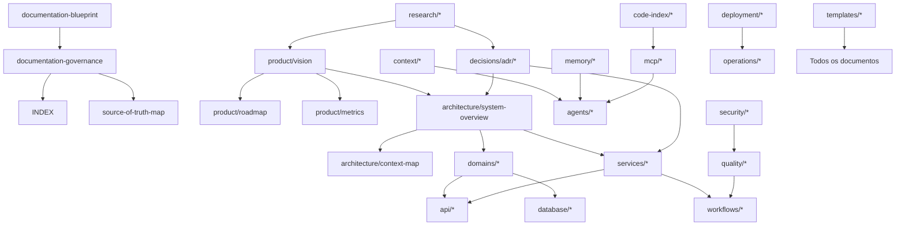
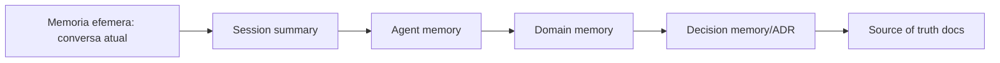
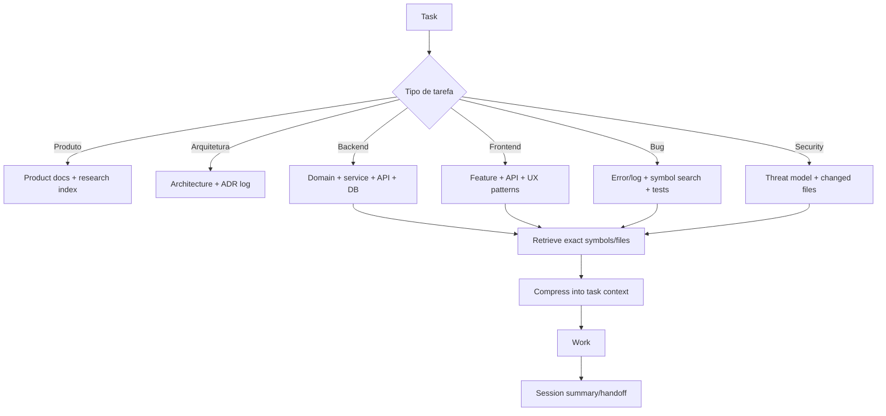
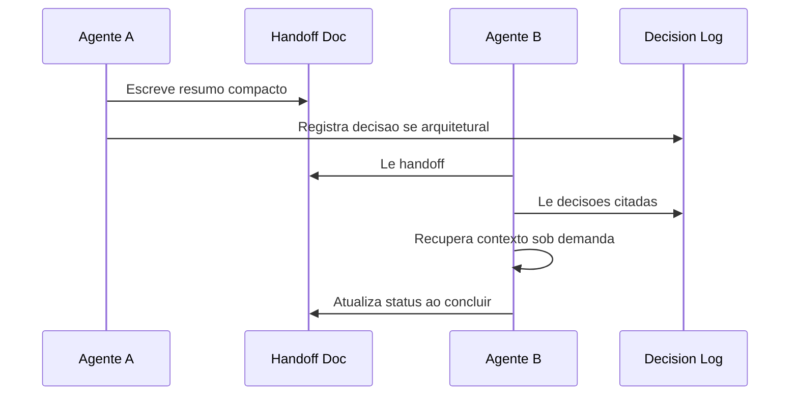

# Engineering Documentation Blueprint

Data: 2026-07-01

Status: proposta inicial para validacao

Escopo desta entrega: projetar a arquitetura documental e operacional para desenvolvimento assistido por IA. Este arquivo nao implementa os documentos detalhados. Ele define a arvore, fontes de verdade, dependencias, agentes, memoria, contexto, MCP, indexacao, governanca e ordem de criacao.

## 1. Principios de Arquitetura Documental

Este projeto sera desenvolvido por humanos e agentes de IA durante meses ou anos. A documentacao deve ser tratada como infraestrutura de desenvolvimento, nao como anexo.

Principios:

- Contexto minimo suficiente: agentes devem ler indices, resumos e contratos antes de abrir arquivos grandes.
- Fontes de verdade explicitas: cada decisao, dominio, API e fluxo deve ter um documento dono.
- Documentacao progressiva: primeiro mapas e contratos; detalhes sob demanda.
- Memoria versionada: conhecimento duravel deve ir para o repositorio; memorias locais sao auxiliares.
- Baixo acoplamento documental: documentos devem referenciar outros por links e IDs, nao duplicar conteudo.
- Rastreabilidade: cada feature deve apontar para produto, arquitetura, API, banco, decisoes e testes.
- Verificacao automatizavel: docs devem ter checklists que CI/agentes consigam validar.
- Handoff compacto: agentes trocam resumos estruturados, nao historicos inteiros.
- Arquivamento sem apagamento de contexto: documentos obsoletos devem ser movidos para arquivo com motivo e substituto.

## 2. Pesquisa Sintetizada: O Que Funciona, O Que Nao Funciona e O Que E Moda

### 2.1 Praticas que funcionam

| Pratica | Por que funciona | Evidencia/observacao | Como usar neste projeto |
|---|---|---|---|
| Explore -> plan -> implement -> verify | Reduz mudancas erradas e retrabalho | Claude Code recomenda separar exploracao, plano, implementacao e commit para tarefas incertas ou multi-arquivo | Todo trabalho relevante comeca em `docs/workflows/development/explore-plan-implement-verify.md` |
| CLAUDE/AGENTS.md curto | Contexto sempre-on cresce rapido e degrada aderencia | Docs Claude alertam que contexto enche rapido e instrucoes longas sao ignoradas | `AGENTS.md` tera so regras globais essenciais; detalhes ficam em docs on-demand |
| Regras acionadas por escopo/glob/manual | Reduz custo de tokens comparado a sempre-on | Devin/Windsurf documenta regras always_on, glob, model_decision e manual com custos diferentes | Criar regras por pasta e skill, nao uma mega-regra global |
| RAG/retrieval com fontes citadas | Atualiza conhecimento sem retreinar e reduz alucinacao | RAG combina memoria parametrica com indice externo recuperavel | Usar busca hibrida BM25 + simbolos + embeddings para docs e codigo |
| Handoffs estruturados | Evita passar conversas gigantes | OpenAI Agents SDK tem handoffs; agentes funcionam melhor com input tipado | Todo handoff usa template de 1 pagina com objetivo, contexto, artefatos e pendencias |
| ADRs curtos | Preservam racional arquitetural com baixo custo | Evidencias recentes favorecem templates concisos como Nygard para adocao | ADR obrigatorio para decisoes caras de reverter |
| Symbol search antes de semantic search | Mais preciso e barato para codigo | LSP padroniza go-to-definition/references; Tree-sitter cria AST incremental | Index local deve expor simbolos, imports, rotas e entidades antes de embeddings |
| Verificacao executavel | Agentes precisam de sinal pass/fail | Claude Code recomenda dar testes/build/lint/screenshot para fechar loop | Todo task doc declara verificacao minima |
| Documentos de contexto em camadas | Evita enviar tudo para toda tarefa | OpenAI separa contexto local de contexto visivel ao LLM; long context pode falhar no meio | Contexto sera dividido em global, dominio, modulo, tarefa e sessao |
| MCP com allowlist | Ferramentas padronizadas evitam custom glue, mas aumentam superficie de risco | MCP e padrao aberto; estudos recentes apontam riscos de seguranca/tool poisoning | MCPs obrigatorios serao poucos, com permissoes e auditoria |

### 2.2 Praticas que nao funcionam bem

| Pratica | Problema | Politica do projeto |
|---|---|---|
| Mega-doc unico de arquitetura | Fica obsoleto, caro de ler e dificil de manter | Dividir por source of truth e manter overview curto |
| Colar arquivos inteiros no prompt | Alto custo, baixa precisao, "lost in the middle" | Agentes devem usar indices, simbolos, trechos e resumos |
| Memoria automatica como fonte de verdade | Local, nao revisada, nao compartilhada | Memoria automatica pode sugerir, mas decisao vai para docs versionados |
| Embeddings como unica busca | Erra simbolos, nomes exatos, contratos e APIs | Busca hibrida: ripgrep/BM25 + LSP + Tree-sitter + embeddings |
| MCP para tudo | Mais risco, manutencao e tokens de schema/tool list | Usar MCP quando reduz buscas repetidas ou integra fonte viva |
| Agentes paralelos sem contrato | Gera conflitos e duplicacao | Paralelismo so com boundaries e handoff template |
| Documentacao que repete codigo | Diverge rapidamente | Docs descrevem por que/contrato; codigo/schema gera referencia |
| "Sempre planejar" | Planejamento vira overhead em tarefas pequenas | Usar arvore de decisao: direto para mudancas triviais; plano para cross-module |

### 2.3 Modismos ou areas imaturas

| Tema | Leitura critica | Decisao |
|---|---|---|
| Multi-agent para qualquer coisa | Muitas tarefas ficam melhores com 1 agente forte + subagente de revisao | Usar multi-agent em pesquisa, reviews, seguranca, arquitetura e grandes refactors |
| MCP marketplaces aleatorios | Estudos mostram muitos servidores invalidos/abandonados e riscos MCP-specific | Evitar servidores desconhecidos; preferir oficiais/maduros |
| Vetorizar todo o repo sem modelo de informacao | Custo e ruido; recuperacao ruim | Indexar docs/codigo por tipo, dono, freshness e simbolos |
| Prompt compression agressiva | Pode remover constraints criticas | Comprimir em camadas com campos obrigatorios preservados |
| Long context como substituto de arquitetura documental | Long context nao garante uso robusto de informacao no meio | Manter contexto pequeno e relevante, com referencias |
| Agentes autonomos sem verificacao | Parece produtivo, mas aumenta risco silencioso | Toda automacao precisa criterio de parada verificavel |

## 3. Referencias Tecnicas Que Guiam o Blueprint

- MCP e um padrao aberto para conectar aplicacoes de IA a sistemas externos, dados, ferramentas e workflows; sua doc oficial destaca recursos como tools, data sources e prompts, alem de suporte amplo de clientes e servidores: <https://modelcontextprotocol.io/docs/getting-started/intro>
- Claude Code recomenda gerenciar contexto agressivamente, dar checks executaveis, explorar antes de implementar e manter `CLAUDE.md` curto; tambem aponta skills, hooks, subagents e MCP como extensoes: <https://code.claude.com/docs/en/best-practices>
- Devin/Windsurf diferencia memories, rules, workflows e skills, e explicita custo de regras always-on versus glob/model/manual: <https://docs.devin.ai/desktop/cascade/memories>
- OpenAI Agents SDK define agentes, handoffs, guardrails, sessions, tracing e MCP como primitivas para apps agenticos: <https://openai.github.io/openai-agents-python/>
- OpenAI Agents SDK separa contexto local de contexto visivel ao LLM e recomenda retrieval/tools para contexto sob demanda: <https://openai.github.io/openai-agents-python/context/>
- LangGraph se posiciona para workflows agenticos longos e stateful com persistence, human-in-the-loop, memory e tracing: <https://docs.langchain.com/oss/python/langgraph/overview>
- Tree-sitter fornece parsing incremental rapido e robusto para ASTs, bom para code indexing local: <https://tree-sitter.github.io/tree-sitter/>
- LSP padroniza autocomplete, go-to-definition e references entre editores e servidores de linguagem: <https://microsoft.github.io/language-server-protocol/>
- Sourcegraph documenta code search com regex, simbolos, commits, diffs, contexts e monitors: <https://sourcegraph.com/docs/code-search>
- RAG foi proposto para combinar memoria parametrica do modelo com memoria externa recuperavel: <https://arxiv.org/abs/2005.11401>
- "Lost in the Middle" mostra que modelos long-context nem sempre usam bem informacao posicionada no meio do contexto: <https://arxiv.org/abs/2307.03172>
- Estudos sobre MCP apontam riscos de tool poisoning, manutencao e seguranca em servidores MCP: <https://arxiv.org/abs/2506.13538>
- Comparacao empirica recente de ADR templates favorece templates concisos como Nygard para compreensao e adocao: <https://arxiv.org/abs/2604.27333>

## 4. Estrutura Mestre de Documentacao

Arvore proposta:

```text
docs/
  README.md
  INDEX.md
  GLOSSARY.md
  _meta/
    documentation-blueprint.md
    documentation-governance.md
    source-of-truth-map.md
    doc-lifecycle.md
    doc-review-checklist.md
    doc-archive-policy.md
  product/
    vision.md
    market-positioning.md
    personas.md
    business-model.md
    pricing.md
    roadmap.md
    metrics.md
    risks.md
  research/
    README.md
    market/
    platforms/
    competitors/
    technical/
    ai-models/
    legal-policy/
  architecture/
    README.md
    system-overview.md
    context-map.md
    quality-attributes.md
    bounded-contexts.md
    integration-architecture.md
    ai-architecture.md
    event-driven-architecture.md
    security-architecture.md
    observability-architecture.md
    scalability-plan.md
  decisions/
    README.md
    decision-log.md
    adr/
    rfc/
  domains/
    README.md
    affiliate/
    marketplace/
    campaign/
    link-tracking/
    analytics/
    billing/
    ai-generation/
    compliance/
    publishing/
    identity/
  services/
    README.md
    backend-api/
    frontend-app/
    workers/
    integration-service/
    ai-service/
    analytics-service/
    link-service/
  api/
    README.md
    rest/
    webhooks/
    events/
    external-integrations/
  database/
    README.md
    schema-overview.md
    migrations.md
    entity-catalog.md
    retention-policy.md
    analytics-model.md
  workflows/
    README.md
    development/
    release/
    incident/
    research/
    feature-delivery/
    ai-assisted/
  agents/
    README.md
    agent-registry.md
    system-architect.md
    backend-engineer.md
    frontend-engineer.md
    ai-engineer.md
    database-engineer.md
    infrastructure-engineer.md
    qa-engineer.md
    security-engineer.md
    product-manager.md
    researcher.md
    technical-writer.md
    analytics-engineer.md
    growth-engineer.md
    handoff-protocol.md
  context/
    README.md
    context-engineering-guide.md
    context-layers.md
    context-budgets.md
    retrieval-strategy.md
    compression-strategy.md
    session-context-template.md
    task-context-template.md
    domain-context-template.md
  memory/
    README.md
    memory-architecture.md
    memory-registry.md
    decision-memory.md
    domain-memory/
    agent-memory/
    session-summaries/
    invalidation-policy.md
  prompts/
    README.md
    prompt-library.md
    system-prompts/
    task-prompts/
    review-prompts/
    compression-prompts/
    evaluation-prompts/
  mcp/
    README.md
    mcp-strategy.md
    mcp-server-registry.md
    project-mcp-spec.md
    security-model.md
    tool-contracts.md
    evaluation.md
  code-index/
    README.md
    indexing-strategy.md
    symbol-index.md
    semantic-index.md
    dependency-graph.md
    code-graph.md
    freshness-policy.md
  quality/
    README.md
    testing-strategy.md
    review-strategy.md
    quality-gates.md
    evals.md
    regression-policy.md
  security/
    README.md
    threat-model.md
    secrets-policy.md
    authz-authn.md
    data-protection.md
    dependency-security.md
    ai-security.md
  deployment/
    README.md
    environments.md
    docker.md
    ci-cd.md
    release-strategy.md
    rollback.md
    kubernetes-future.md
  operations/
    README.md
    runbooks/
    playbooks/
    monitoring.md
    alerting.md
    incident-response.md
    backup-restore.md
  onboarding/
    README.md
    human-onboarding.md
    agent-onboarding.md
    local-dev.md
    first-task.md
  templates/
    README.md
    adr.md
    rfc.md
    research.md
    feature.md
    bug.md
    task.md
    memory.md
    architecture.md
    service.md
    domain.md
    api.md
    database.md
    workflow.md
    playbook.md
    checklist.md
    runbook.md
    prompt.md
    agent-memory.md
    session-summary.md
    handoff.md
    context-summary.md
    decision-log-entry.md
  archive/
    README.md
    superseded/
    rejected/
    historical/
```

Arquivos raiz complementares:

```text
AGENTS.md
README.md
CONTRIBUTING.md
CHANGELOG.md
.docs-index.json
.context-manifest.json
.mcp/project-server-spec.yaml
```

## 5. Objetivo de Cada Area

| Area | Objetivo | Source of truth? | Quem le primeiro |
|---|---|---:|---|
| `docs/_meta` | Governanca da documentacao | Sim | Todos agentes |
| `docs/product` | Produto, negocio, roadmap e metricas | Sim para produto | PM, architect, growth |
| `docs/research` | Evidencias externas e pesquisas versionadas | Nao, alimenta decisoes | Researcher, PM, architect |
| `docs/architecture` | Arquitetura alvo e constraints globais | Sim para arquitetura | Architect, todos seniors |
| `docs/decisions` | ADRs/RFCs e log decisorio | Sim para decisoes | Todos |
| `docs/domains` | Modelo de dominio e regras de negocio | Sim para negocio interno | Backend, frontend, QA |
| `docs/services` | Responsabilidades e contratos internos | Sim por servico | Backend, infra |
| `docs/api` | Contratos REST/webhook/eventos | Sim para integracao | Backend, frontend, QA |
| `docs/database` | Schema, entidades, retencao | Sim para dados | DB, backend, analytics |
| `docs/workflows` | Como trabalhar e operar | Sim para processo | Todos |
| `docs/agents` | Perfis, limites e handoffs | Sim para multi-agent | Agentes |
| `docs/context` | Estrategia de contexto e retrieval | Sim para contexto | Todos agentes |
| `docs/memory` | Memoria duravel e invalidacao | Sim para memoria | Todos agentes |
| `docs/prompts` | Prompts aprovados e versionados | Sim para prompts | AI engineer, agents |
| `docs/mcp` | Estrategia e contratos MCP | Sim para ferramentas | Architect, AI engineer |
| `docs/code-index` | Busca, simbolos, grafo e freshness | Sim para indexacao | AI engineer, tooling |
| `docs/quality` | Testes, gates e evals | Sim para qualidade | QA, backend, frontend |
| `docs/security` | Threat model e seguranca | Sim para seguranca | Security, architect |
| `docs/deployment` | Ambientes e release | Sim para deploy | DevOps, backend |
| `docs/operations` | Runbooks e incidentes | Sim para operacao | DevOps, support |
| `docs/onboarding` | Entrada de humanos/agentes | Sim para onboarding | Novos agentes/humanos |
| `docs/templates` | Esqueletos oficiais | Sim para formato | Todos |
| `docs/archive` | Historico obsoleto | Nao, referencia historica | Architect, writer |

## 6. Dependencias Entre Documentos



Regra: documento filho pode referenciar pai; pai nao deve duplicar detalhes do filho. Exemplo: `architecture/system-overview.md` aponta para `domains/affiliate/README.md`, mas nao copia regras de afiliacao.

## 7. Ordem Ideal de Criacao

### Fase 0: antes do primeiro commit funcional

Obrigatorios:

1. `AGENTS.md`
2. `docs/README.md`
3. `docs/INDEX.md`
4. `docs/_meta/documentation-blueprint.md`
5. `docs/_meta/source-of-truth-map.md`
6. `docs/product/vision.md`
7. `docs/product/personas.md`
8. `docs/product/roadmap.md`
9. `docs/architecture/system-overview.md`
10. `docs/architecture/context-map.md`
11. `docs/decisions/decision-log.md`
12. `docs/context/context-engineering-guide.md`
13. `docs/memory/memory-architecture.md`
14. `docs/agents/agent-registry.md`
15. `docs/agents/handoff-protocol.md`
16. `docs/templates/adr.md`
17. `docs/templates/handoff.md`
18. `docs/templates/session-summary.md`

### Fase 1: antes do MVP tecnico

1. `docs/domains/affiliate/README.md`
2. `docs/domains/marketplace/README.md`
3. `docs/domains/campaign/README.md`
4. `docs/domains/link-tracking/README.md`
5. `docs/services/backend-api/README.md`
6. `docs/services/frontend-app/README.md`
7. `docs/api/rest/README.md`
8. `docs/database/schema-overview.md`
9. `docs/workflows/development/explore-plan-implement-verify.md`
10. `docs/quality/testing-strategy.md`
11. `docs/security/secrets-policy.md`
12. `docs/deployment/docker.md`

### Fase 2: antes do beta fechado

1. `docs/mcp/mcp-strategy.md`
2. `docs/mcp/project-mcp-spec.md`
3. `docs/code-index/indexing-strategy.md`
4. `docs/quality/quality-gates.md`
5. `docs/security/threat-model.md`
6. `docs/operations/runbooks/local-troubleshooting.md`
7. `docs/product/metrics.md`
8. `docs/research/platforms/tiktok-shop.md`
9. `docs/research/platforms/shopee.md`
10. `docs/research/platforms/mercado-livre.md`
11. `docs/research/platforms/amazon-associates.md`

### Fase 3: antes de producao

1. `docs/deployment/environments.md`
2. `docs/deployment/ci-cd.md`
3. `docs/deployment/release-strategy.md`
4. `docs/deployment/rollback.md`
5. `docs/operations/incident-response.md`
6. `docs/operations/backup-restore.md`
7. `docs/security/data-protection.md`
8. `docs/security/ai-security.md`
9. `docs/quality/evals.md`
10. `docs/analytics/` se criado ou `docs/database/analytics-model.md`

### Fase futura

- `docs/deployment/kubernetes-future.md`
- `docs/mcp/evaluation.md`
- `docs/code-index/code-graph.md`
- `docs/operations/playbooks/growth-experiments.md`
- `docs/services/integration-service/marketplace-connectors.md`

## 8. Classificacao: Obrigatorio, Opcional e Futuro

| Classe | Criterio | Exemplos |
|---|---|---|
| Obrigatorio | Sem ele agentes tomam decisoes erradas ou duplicam contexto | `AGENTS.md`, `system-overview`, `source-of-truth-map`, `decision-log`, `context-engineering-guide` |
| Opcional | Ajuda, mas pode nascer quando area ficar ativa | `observability-architecture`, `growth-engineer`, `prompt-library` completa |
| Futuro | Depende de escala/producao | Kubernetes, code graph completo, MCP proprio em producao, data warehouse |

## 9. Fontes de Verdade

| Tema | Fonte de verdade | Documentos derivados |
|---|---|---|
| Visao de produto | `docs/product/vision.md` | roadmap, metrics, features |
| Personas | `docs/product/personas.md` | campaign templates, UX, prompts |
| Arquitetura | `docs/architecture/system-overview.md` | services, deployment, ADRs |
| Decisoes | `docs/decisions/adr/*.md` + `decision-log.md` | architecture, services |
| Dominio | `docs/domains/*/README.md` | API, database, tests |
| API | `docs/api/rest/*` ou OpenAPI quando existir | frontend, SDK, tests |
| Banco | migrations + `docs/database/schema-overview.md` | entity catalog |
| Processo de agentes | `docs/agents/agent-registry.md` | handoffs, workflows |
| Contexto | `docs/context/context-engineering-guide.md` | MCP, memory, prompts |
| Memoria | `docs/memory/memory-architecture.md` | agent memory, session summaries |
| MCP | `docs/mcp/mcp-strategy.md` | project MCP spec |
| Qualidade | `docs/quality/quality-gates.md` | CI, workflows |
| Seguranca | `docs/security/threat-model.md` | coding rules, review checklists |

Se houver conflito, a ordem de precedencia e:

1. Codigo executavel e contratos gerados.
2. ADR aceito mais recente.
3. Documento source of truth da area.
4. Documento derivado.
5. Memoria de agente.
6. Conversa antiga.

## 10. Sistema de Memoria para IA

### 10.1 Camadas de memoria



Camadas:

- Conversa atual: contexto temporario, descartavel.
- Session summary: resumo compacto ao fim de uma sessao.
- Agent memory: aprendizados de um papel especifico.
- Domain memory: fatos e invariantes de um dominio.
- Decision memory: indice de ADRs e decisoes.
- Source-of-truth docs: conhecimento duravel revisado.

### 10.2 Estrutura proposta

```text
docs/memory/
  memory-architecture.md
  memory-registry.md
  invalidation-policy.md
  decision-memory.md
  domain-memory/
    affiliate.md
    marketplace.md
    campaign.md
    link-tracking.md
  agent-memory/
    backend-engineer.md
    frontend-engineer.md
    ai-engineer.md
    security-engineer.md
  session-summaries/
    YYYY-MM-DD-topic.md
```

### 10.3 Regras de memoria

- Memoria nao substitui ADR.
- Memoria nao pode conter segredo, token, credencial ou dados sensiveis.
- Toda memoria deve ter `created_at`, `last_verified_at`, `source`, `scope`, `confidence`, `expires_at`.
- Memoria de baixa confianca deve ser tratada como pista, nao verdade.
- Memoria que impacta arquitetura deve virar ADR ou atualizacao de source of truth.
- Memoria que contradiz codigo ou ADR vira `stale` ate revisao.

### 10.4 Invalidacao

Invalidar quando:

- arquivo source-of-truth relacionado muda;
- ADR supersede decisao antiga;
- migration altera entidade;
- API muda contrato;
- teste/eval contradiz memoria;
- documento ultrapassa `expires_at`.

Mecanismo:

```text
doc_id: domain-affiliate-memory
depends_on:
  - docs/domains/affiliate/README.md
  - docs/decisions/adr/0003-affiliate-link-model.md
freshness:
  last_verified_at: 2026-07-01
  expires_at: 2026-10-01
status: active | stale | superseded | archived
```

## 11. Sistema de Context Engineering

### 11.1 Camadas de contexto

| Camada | Conteudo | Tamanho alvo | Quando carregar |
|---|---|---:|---|
| Global | AGENTS, comandos, regras essenciais | 500-1200 tokens | Sempre |
| Product | visao, personas, roadmap | 800-1500 | Features/produto |
| Architecture | overview, ADRs relevantes | 1000-2500 | Mudancas estruturais |
| Domain | regras de negocio especificas | 800-2000 | Feature do dominio |
| Module | files, APIs, schemas do modulo | variavel | Implementacao |
| Task | objetivo, constraints, acceptance | 300-1000 | Sempre na tarefa |
| Session | resumo do trabalho atual | 300-800 | Continuidade |
| Evidence | testes, logs, diff, screenshots | sob demanda | Verificacao |

### 11.2 Orcamento de contexto

Regra recomendada:

- 10% instrucoes globais.
- 15% resumo de produto/arquitetura.
- 25% dominio/modulo.
- 25% codigo/contratos relevantes.
- 15% task/acceptance/tests.
- 10% margem para outputs e correcao.

Anti-regra: nunca preencher contexto so porque ha espaco. Long context custa mais e pode reduzir foco.

### 11.3 Fluxo de recuperacao



### 11.4 Context compression

Comprimir preservando:

- objetivo;
- arquivos tocados;
- decisoes;
- invariantes;
- contratos;
- testes rodados;
- pendencias;
- riscos.

Nunca comprimir removendo:

- constraints de seguranca;
- migrations pendentes;
- regras de dominio;
- acceptance criteria;
- IDs de ADR/RFC;
- comandos de verificacao.

## 12. Agentes Especializados

| Agente | Responsabilidade | Le primeiro | Atualiza | Contexto alvo | Encerramento |
|---|---|---|---|---:|---|
| System Architect | arquitetura, ADRs, boundaries | architecture, decisions, product | ADR/RFC, architecture | 8k-20k | decisao registrada e impactos listados |
| Backend Engineer | Go APIs, services, workers | domain, service, api, db | service docs, API notes | 8k-16k | testes/lint/build ou plano tecnico |
| Frontend Engineer | Next.js, UX operacional | product, api, feature docs | frontend service docs | 8k-16k | UI validada ou wireflow aceito |
| AI Engineer | prompts, providers, evals | ai-architecture, prompts, quality | prompts, evals | 8k-20k | prompt/eval versionado |
| Database Engineer | schema, migrations, queries | database, domain, ADR | database docs | 8k-14k | migration strategy validada |
| Infrastructure Engineer | Docker, envs, future K8s | deployment, operations | deployment docs | 8k-14k | runbook/verificacao |
| DevOps | CI/CD, release, rollback | deployment, quality | workflows, runbooks | 8k-14k | pipeline/gate definido |
| QA Engineer | testes, regressao, acceptance | quality, product, domain | test strategy, checklists | 8k-14k | matriz de testes pronta |
| Security Engineer | threat model, secrets, auth | security, architecture | threat model, reviews | 8k-18k | riscos e mitigacoes |
| Researcher | pesquisa oficial e concorrentes | research index | research docs | 8k-20k | fontes citadas e incertezas |
| Product Manager | roadmap, escopo, personas | product, research | roadmap, feature docs | 8k-16k | criterios de sucesso |
| Technical Writer | docs, templates, consistencia | _meta, templates | docs, index | 8k-14k | docs linkadas e sem duplicacao |
| Analytics Engineer | tracking, metricas, warehouse futuro | product metrics, db | analytics model | 8k-14k | metric contract definido |
| Growth Engineer | experimentos e aquisicao | product, metrics | growth playbooks | 8k-14k | experimento mensuravel |

Regra: agentes nao devem ler `docs/research/**` inteiro. Devem consultar `research/README.md` e abrir apenas arquivos citados.

## 13. Handoff Entre Agentes

Todo handoff deve caber em 1-2 paginas.

Campos obrigatorios:

```text
handoff_id:
from_agent:
to_agent:
task:
current_state:
source_of_truth_read:
files_or_docs_changed:
decisions_made:
open_questions:
risks:
verification_done:
next_actions:
context_to_load_next:
do_not_repeat:
```

Fluxo:



## 14. Estrategia MCP

### 14.1 Quando usar MCP

Usar MCP quando:

- a fonte e viva e muda fora do repo;
- ferramenta reduz varias leituras manuais;
- permissao e auditoria sao claras;
- output pode ser pequeno e estruturado;
- varios agentes precisam da mesma capacidade.

Nao usar MCP quando:

- um arquivo versionado resolve;
- a ferramenta exige acesso amplo demais;
- servidor e pouco mantido;
- resposta grande aumenta tokens sem selecao;
- acao tem risco alto sem human-in-the-loop.

### 14.2 Classificacao de MCP servers

| Classe | Servidor | Objetivo | Beneficio | Risco | Maturidade |
|---|---|---|---|---|---|
| Obrigatorio | Filesystem/repo local | leitura estruturada de docs/codigo | reduz prompts manuais | acesso indevido | alta se sandboxed |
| Obrigatorio | Git/GitHub | issues, PRs, diffs, history | rastreabilidade | permissoes | alta |
| Obrigatorio | Project MCP proprio | contexto do projeto | maior economia de tokens | precisa manutencao | futura/media |
| Recomendado | PostgreSQL read-only local | schema e queries dev | evita abrir migrations grandes | dados sensiveis | alta se read-only |
| Recomendado | Browser/docs official | docs oficiais atuais | reduz erro de API | web noise | media |
| Recomendado | Figma/design | specs UI | evita screenshot manual | dados externos | media |
| Opcional | Slack/Linear/Jira | requisitos externos | contexto de produto | ruido/privacidade | media |
| Opcional | Sentry/observability | incidentes | debugging real | dados sensiveis | media |
| Futuro | Vector DB MCP | retrieval semantico | memoria/code search | custo/qualidade | media |
| Futuro | Cloud provider MCP | infra ops | automacao | risco alto | variavel |

### 14.3 Modelo de seguranca MCP

- Deny-by-default.
- Tool allowlist por agente.
- Read-only por padrao.
- Escrita exige approval/human-in-the-loop.
- Sem MCP de terceiros desconhecido em producao de agentes.
- Logs de tool calls.
- Redacao de segredos em outputs.
- Revisao trimestral de servidores.

## 15. MCP Proprio do Projeto

Objetivo: evitar que agentes abram dezenas de arquivos para responder "onde fica X?".

Ferramentas propostas:

| Tool | Entrada | Saida | Como reduz tokens |
|---|---|---|---|
| `find_service` | nome/capacidade | service doc + arquivos chave | evita listar repo |
| `find_domain` | termo de negocio | dominio, regras, entidades | evita abrir todos domains |
| `find_entity` | entidade | schema, dominio, API relacionada | une DB + dominio |
| `find_api` | rota/caso de uso | contrato + handlers | recupera endpoint exato |
| `find_database` | tabela/campo | migrations + docs | evita ler migrations inteiras |
| `find_workflow` | tarefa | workflow aprovado | evita reexplicar processo |
| `find_pipeline` | pipeline/job | eventos, workers, retries | contexto operacional |
| `find_prompt` | tarefa IA | prompt versionado + eval | evita prompts soltos |
| `find_feature` | feature | produto + dominio + API | contexto vertical |
| `find_decision` | tema | ADRs relevantes | evita decision-log completo |
| `impact_analysis` | arquivo/entidade | dependencias e testes | reduz investigacao manual |
| `search_docs` | query | trechos docs com fonte | retrieval direcionado |
| `related_modules` | arquivo/modulo | imports, chamadas, rotas | economiza symbol search |
| `task_context` | task id | pacote de contexto compacto | carregamento de tarefa |
| `architecture_summary` | area | resumo + links | evita mega-doc |
| `domain_summary` | dominio | invariantes + docs | contexto rapido |
| `memory_summary` | escopo | memorias ativas e stale | evita repeticao |
| `recent_changes` | periodo/area | commits/docs alterados | onboarding de sessao |
| `dependency_graph` | modulo | grafo resumido | impacto antes de editar |

Saida padrao de cada tool:

```json
{
  "summary": "...",
  "sources": [{"path": "...", "lines": "10-40", "freshness": "active"}],
  "related": ["..."],
  "risks": ["..."],
  "next_queries": ["..."]
}
```

## 16. Estrategia de Code Index

### 16.1 Camadas

| Camada | Tecnologia | Uso |
|---|---|---|
| Texto exato | ripgrep/BM25 | nomes, erros, rotas, configs |
| Simbolos | LSP/gopls/tsserver | definition, references, rename |
| AST | Tree-sitter | extrair funcoes, imports, structs, JSX |
| Grafo | import graph + call graph parcial | impacto e arquitetura |
| Semantico | embeddings | perguntas conceituais e docs |
| Metadados | `.docs-index.json` | donos, freshness, source-of-truth |

### 16.2 Decisao recomendada

MVP tooling:

- `rg` + `go list` + `gopls` + TypeScript language server.
- Tree-sitter para extrair simbolos basicos multi-linguagem.
- Embeddings apenas para `docs/` e comentarios arquiteturais inicialmente.

Futuro:

- Code graph persistido em SQLite/Postgres.
- Vector DB local ou Postgres pgvector.
- MCP proprio consultando esse indice.

Justificativa: simbolos e texto exato sao mais baratos e precisos para codigo. Embeddings entram para recuperacao conceitual, nao para substituir LSP.

## 17. Documentacao Viva

### 17.1 Regras de sincronizacao

- Toda mudanca de contrato API atualiza `docs/api` ou OpenAPI.
- Toda migration atualiza `docs/database/schema-overview.md` se alterar entidade conceitual.
- Toda decisao arquitetural exige ADR.
- Toda feature nova exige feature doc ou entrada no roadmap/backlog.
- Todo prompt usado em producao deve estar versionado em `docs/prompts`.
- Todo workflow operacional repetido vira runbook/playbook.

### 17.2 Checks automatizaveis

Checklist de PR:

- [ ] Mudou API? Docs/API atualizados.
- [ ] Mudou schema? Database docs/migration notes atualizados.
- [ ] Mudou arquitetura? ADR criado/atualizado.
- [ ] Mudou comportamento de dominio? Domain doc atualizado.
- [ ] Mudou prompt/IA? Prompt e eval atualizados.
- [ ] Mudou deploy/env? Deployment docs atualizados.
- [ ] Criou conhecimento duravel? Memory/source-of-truth atualizado.

Automacoes futuras:

- script `docs check` valida links internos;
- script detecta migrations sem nota;
- script compara rotas registradas versus docs API;
- script marca docs stale por `last_verified_at`;
- CI bloqueia ADR sem decision-log update;
- MCP `recent_changes` sugere docs impactados.

## 18. Criterios Para Dividir Documentos

Dividir quando:

- passar de 250-400 linhas;
- cobrir mais de um dono;
- tiver mais de uma cadencia de mudanca;
- agentes precisarem ler so uma secao repetidamente;
- houver subdominio com regras proprias;
- houver conflito entre source-of-truth e detalhe operacional.

Nao dividir quando:

- documento e checklist curto;
- conteudo precisa ser lido inteiro para fazer sentido;
- fragmentacao criaria navegacao pior que leitura.

## 19. Criterios Para Arquivar Obsoletos

Mover para `docs/archive/` quando:

- ADR for superseded;
- pesquisa for antiga e substituida;
- feature for cancelada;
- tecnologia for removida;
- documento nao tiver dono ativo.

Todo arquivo arquivado deve incluir cabecalho:

```yaml
status: archived
archived_at:
reason:
superseded_by:
owner:
```

## 20. Estrategia de Versionamento

- Docs versionados junto com codigo no Git.
- ADRs sao imutaveis apos aceitos, exceto correcoes de typo; mudancas criam novo ADR que supersede.
- Research pode ser atualizado com `last_checked_at`.
- Templates tem `template_version`.
- Prompts tem `prompt_version` e changelog.
- Source-of-truth docs tem `status`, `owner`, `last_verified_at`.

Padrao de frontmatter:

```yaml
title:
status: draft | active | stale | superseded | archived
owner:
last_verified_at:
source_of_truth: true | false
depends_on:
supersedes:
superseded_by:
```

## 21. Matriz de Prioridade

| Documento | Prioridade | Risco se faltar | Custo | Criar quando |
|---|---:|---|---:|---|
| `AGENTS.md` | P0 | agentes inconsistentes | baixo | agora |
| `source-of-truth-map` | P0 | docs conflitantes | medio | agora |
| `system-overview` | P0 | arquitetura dispersa | medio | agora |
| `context-engineering-guide` | P0 | gasto de tokens alto | medio | agora |
| `memory-architecture` | P0 | repeticao e esquecimento | medio | agora |
| `agent-registry` | P0 | handoffs ruins | medio | agora |
| `domain docs MVP` | P1 | regras duplicadas | medio | antes MVP |
| `api docs` | P1 | frontend/backend desalinhados | medio | antes endpoints |
| `mcp-strategy` | P1 | tooling inseguro | medio | antes MCP |
| `code-index` | P2 | busca manual demais | alto | beta |
| `kubernetes-future` | P3 | baixo no inicio | medio | escala |

## 22. Matriz de Riscos

| Risco | Prob. | Impacto | Mitigacao |
|---|---:|---:|---|
| Docs virarem deposito morto | Alta | Alto | source-of-truth map + PR checklist + owners |
| Contexto sempre-on inchado | Alta | Alto | AGENTS curto + docs on-demand |
| Agentes repetirem pesquisa | Alta | Medio | memory registry + research index |
| MCP inseguro | Media | Alto | allowlist, read-only, auditoria |
| Embeddings retornarem contexto errado | Media | Medio | busca hibrida e citacoes de fonte |
| ADRs burocraticos | Media | Medio | template curto e criterio claro |
| Documentos pequenos demais fragmentarem | Media | Baixo | criterios de divisao |
| Handoffs omitirem decisoes | Media | Alto | template obrigatorio |
| Codigo divergir dos docs | Alta | Alto | CI docs check + checklist PR |

## 23. Checklist de Adocao

Antes de implementar features:

- [ ] Aprovar este blueprint.
- [ ] Criar `AGENTS.md` minimo.
- [ ] Criar `docs/INDEX.md`.
- [ ] Criar `source-of-truth-map`.
- [ ] Criar `product/vision`, `personas`, `roadmap`.
- [ ] Criar `architecture/system-overview`.
- [ ] Criar `context-engineering-guide`.
- [ ] Criar `memory-architecture`.
- [ ] Criar `agent-registry` e `handoff-protocol`.
- [ ] Criar templates base: ADR, handoff, session summary, feature, task.

Antes de ativar multi-agent:

- [ ] Cada agente tem docs que le/atualiza.
- [ ] Handoff protocol aprovado.
- [ ] Limites de contexto definidos.
- [ ] Critérios de encerramento definidos.
- [ ] Revisao adversarial definida para tarefas sensiveis.

Antes de instalar MCPs:

- [ ] MCP strategy aprovado.
- [ ] Lista allowlist definida.
- [ ] Permissoes por agente definidas.
- [ ] Logs/auditoria definidos.
- [ ] Plano de remocao/revogacao definido.

## 24. Anti-Patterns Oficiais do Projeto

- "Leia o repo inteiro."
- "Coloque tudo no AGENTS.md."
- "Use embeddings para tudo."
- "MCP resolve governanca."
- "Toda tarefa precisa de 10 agentes."
- "Documente depois."
- "A conversa do agente e documentacao."
- "O plano esta no chat."
- "Copie a mesma regra em cinco lugares."
- "Aceite servidor MCP desconhecido porque parece util."

## 25. Proxima Etapa Apos Validacao

Se este blueprint for aprovado, a ordem de execucao recomendada e:

1. Criar `AGENTS.md`.
2. Criar `docs/README.md` e `docs/INDEX.md`.
3. Criar `docs/_meta/source-of-truth-map.md`.
4. Criar `docs/product/vision.md`.
5. Criar `docs/architecture/system-overview.md`.
6. Criar `docs/context/context-engineering-guide.md`.
7. Criar `docs/memory/memory-architecture.md`.
8. Criar `docs/agents/agent-registry.md`.
9. Criar `docs/agents/handoff-protocol.md`.
10. Criar templates base.

Cada documento deve ser criado em execucao independente, revisado e aprovado antes do proximo. Se durante uma execucao surgir necessidade de alterar esta estrutura, a alteracao deve ser proposta no blueprint antes de continuar.
