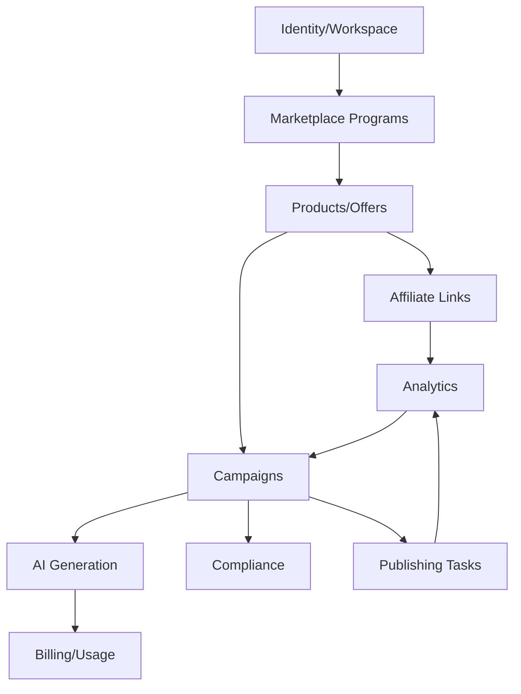

# Context Map

## Boundary Rules

- Marketplace integrations normalize external programs into internal products, offers, links, and reports.
- Campaign generation must not own product truth.
- Analytics reads click and conversion events; it does not mutate campaign content.
- Compliance checks annotate and block risky outputs; they do not generate copy.
- Billing consumes usage events; it does not call AI providers directly.

## Domain Docs

- Identity/Workspace: `docs/domains/identity/README.md`
- Marketplace Programs: `docs/domains/marketplace/README.md`
- Products/Offers: `docs/domains/product/README.md`
- Affiliate Links: `docs/domains/affiliate/README.md`
- Link Tracking: `docs/domains/link-tracking/README.md`
- Campaigns: `docs/domains/campaign/README.md`
- Analytics: `docs/domains/analytics/README.md`
- Compliance: `docs/domains/compliance/README.md`
