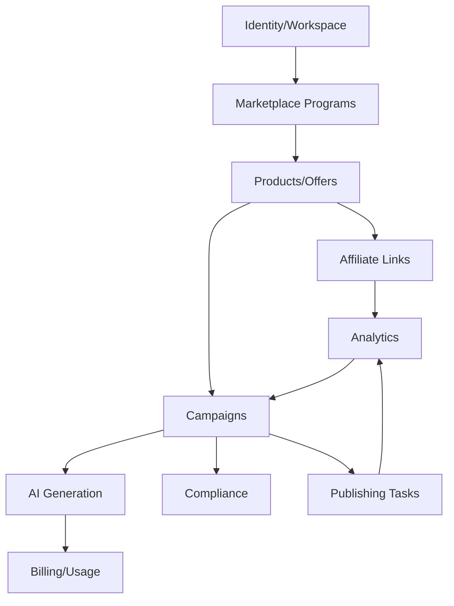

# Context Map

## Boundary Rules

- Marketplace integrations normalize external programs into internal products, offers, links, and reports.
- Campaign generation must not own product truth.
- Analytics reads click and conversion events; it does not mutate campaign content.
- Compliance checks annotate and block risky outputs; they do not generate copy.
- Billing consumes usage events; it does not call AI providers directly.

