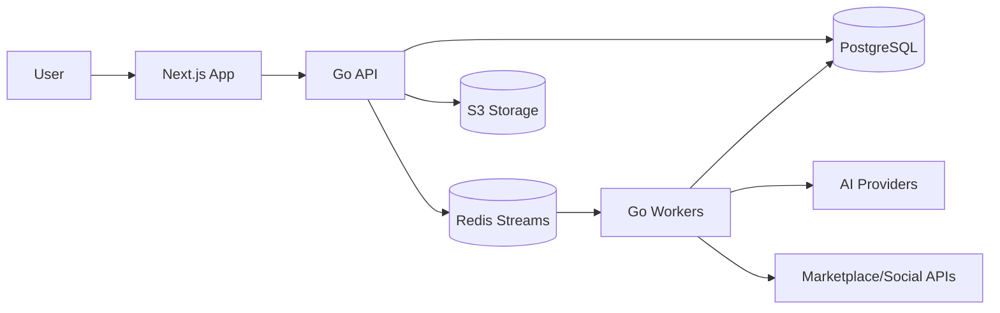

# System Overview

## Architecture Style

Start as a modular monolith with clear domain boundaries and async workers. Do not start with microservices. Extract services only when operational load, team ownership, or scaling requirements justify it.

## Preferred Stack

- Backend: Go.
- Database: PostgreSQL.
- Queue: Redis Streams for MVP.
- Storage: S3-compatible object storage.
- Frontend: Next.js + React.
- Deploy: Docker first.

## Accepted Foundational Decisions

- Backend module layout: `docs/decisions/adr/001-backend-module-layout.md`
- HTTP router/framework: `docs/decisions/adr/002-http-router-framework.md`
- Database migration tool: `docs/decisions/adr/003-database-migration-tool.md`
- Auth/session strategy: `docs/decisions/adr/004-auth-session-strategy.md`
- Short-link tracking strategy: `docs/decisions/adr/005-short-link-tracking-strategy.md`

## Major Modules

- Identity and workspace.
- Marketplace/program catalog.
- Product and offer catalog.
- Affiliate link and click tracking.
- Campaign studio.
- AI generation.
- Compliance checks.
- Publishing tasks.
- Conversion imports.
- Analytics dashboard.
- Billing and usage.

## Initial Runtime

## Key Decisions Pending ADRs

- AI provider abstraction.
- Redis Streams consumer group conventions.
